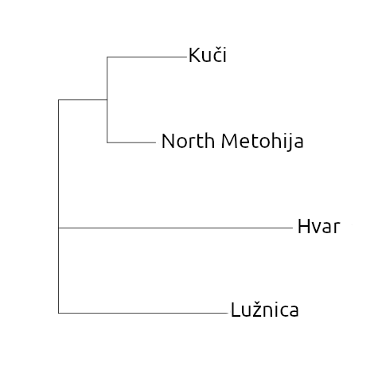

# XIX Annual Sergei Starostin Memorial Conference on Comparative-Historical Linguistics
Code and materials for talk on XIX Annual Sergei Starostin Memorial Conference on Comparative-Historical Linguistics

Data gathered by @ViaCossa

Ilia Afanasev
Viacheslav V. Kozak

The 1990s–2020s witnessed a major rise in the wordlist-based internal classification of small closely related territorial lects (Normanskaya, 2020; Shim and Nerbonne, 2022). This type of an automatic-language-distance-measurement-based classification utilizes string similarity measures, such as the Levenshtein distance, that provide more fine-grained comparative analysis of units than the traditional lexicostatistical methods. String similarity measures require strict one-to-one concept-to-lexeme matches for each concept of each given lect (Wichmann et al., 2022). However, a high degree of lexical variation within small territorial lects often complicates string-similarity-based language distance scoring with one-to-many concept-to-lexeme matches, even when strict formalised criteria to eliminate them are applied (Kassian et al., 2010; Afanasev, 2023).

The talk presents the methods of automatic language distance measurement for the lects with a high degree of lexical variation. The baseline are average, minimal and maximal distance values between all the lexeme pairs for each concept. A more linguistically interpretable method requires establishing a threshold that dismisses guaranteed mismatches. Evaluation employs mutual clustering information. Cross-evaluation techniques include black-box methods (Afanasev, in print). The talk demonstrates the advantages of introducing a minimal threshold.

The study utilises the wordlist material of the Hvar, Kuči, North Metohija and Lužnica (BCSM, South Slavic) lects. 

Figure. Preliminary average tree, generated with NJ classifier by threshold method and LDND calculation. Thresholds are 0.5 and 0.66.
